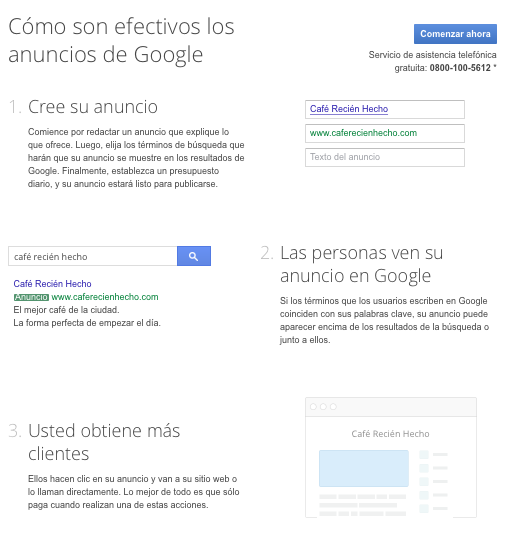
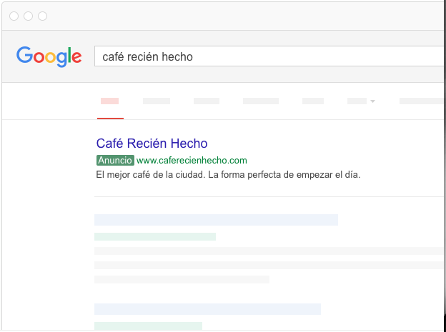
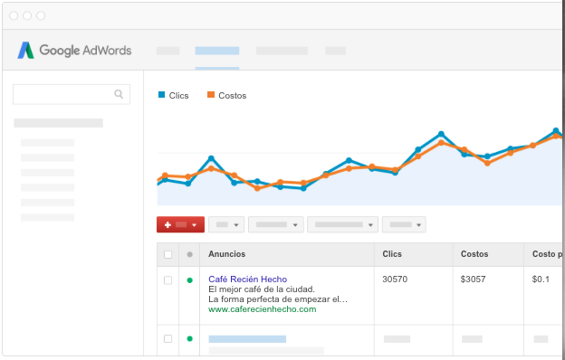

```{r setup, include=FALSE}
knitr::opts_chunk$set(echo = TRUE)
library(readr)
library(knitr)
```

## ¿Cuál es el problema que queremos resolver?

Contamos con datos sobre campañas de publicidad en internet. Estos datos provienen de algún motor de publicidad en internet mediante palabras claves como [**Google Adwords**](https://www.google.co.ve/adwords/?channel=ha&sourceid=awo&subid=rola-es-ha-aw-bhrh&gclid=Cj0KEQjwuZvIBRD-8Z6B2M2Sy68BEiQAtjYS3DK1t7RTmcIKbHEq57eBanGEAdgokPpx_IA0KL59WVEaAuRl8P8HAQ). Estos motores parten de la búsqueda y generan los resultados que más se ajustan. El éxito de un buscador es generar resultados relevantes para cada búsqueda y para ello se basan en el contexto (información de distintas fuentes sobre el que busca, donde lo realiza, el horario, lo que busca específicamente, diversas opciones, etc).



La publicidad en Internet se basa en unir la oferta con la demanda, permitiendo a los usuarios conseguir información relevante por una parte y por la otra permitiendo a los anunciantes ofrecer información relevante que termine generando algún beneficio para el anunciante.

El proceso que siguen estos sistemas es el siguiente:

- El anunciante define las palabras claves que caracterizan el contenido de su sitio web.



- A partir de estas palabras y la combinación de estas palabras se crean campañas de manera que cada vez que un usuario busca algún contenido relacionado con dichas palabras el sitio web del anunciante aparezca en la mejor posición posible.
- El anunciante define el costo (máximo) que está dispuesto a pagar por un click, esto se denomina CPC (Costo por Click). A partir de varias métricas como el Qscore, que mide la calidad del contenido en base a las palabras claves y la experiencia de los usuarios en el sitio web del anunciante. El sistema busca la mejor combinación entre CPC y Qscore (entre otras) para generar una lista de resultados ordenada en base al que está dispuesto a pagar más y tiene mejor contenido. De esta manera se genera el contenido más relevante, con la mejor experiencia de usuario y al mismo tiempo le genera el mejor negocio al buscador.



Se desea minimizar el costo y maximizar las ventas. Es decir, se desea que el `Costconv` sea mínimo para obtener la mayor cantidad de ventas al menor costo posible.

## Limpieza de datos

Lo primero que hemos hecho es tomar los datos provisto en Excel y hemos convertido los datos a números y las variables como porcentajes también se han convertido a un número.

Las actividades realizadas paso a paso son las siguientes:

- `CTR`: Se dividió el número entre $100$ para convertirlo a un número.

- `Convrate`: Se dividió entre $10000$ para convertirla a un número.

Después de realizar la conversión en Excel se cargaron los datos en **R** mediante el comando `read_delim`, donde especificamos el separador de los campos como ";" y el separador de miles "," y símbolo decimal ".".

A continuación podemos ver el comando ejecutado para importar los datos.
```{r, echo=TRUE, message=FALSE}
data <- read_delim("../data/ROW.csv", 
    ";", escape_double = FALSE, locale = locale(decimal_mark = ",", 
    grouping_mark = "."), trim_ws = TRUE)
```

Vamos a ver las primeras 6
```{r}
head(data, n=6)
```

Como se puede observar los datos se encuentran en un directorio `data`.

## Variables[^2]

| Nombre          | Descripción                                                                 |
|-----------------|-----------------------------------------------------------------------------|
| Adgroup         | Grupos de campañas publicitarias                                            |
| MaxCPC          | Lo que el dueño de la campaña está dispuesto a pagar por publicidad. (Bid)  |
| Clicks          | Número de veces que un usuario de internet hace click sobre la publicidad.  |
| Impressions     | Total de veces que la publicidad fué impresa en internet.  |
| CTR             | Cociente entre Clicks e Impressions   |
| AvgCPC          | Lo que termina pagando por la publicación de la publicidad.  |
| Costo           | Gasto de publicidad. |
| AvgPosition     | Posición promedio en la que sale el anuncio publicitario. |
| Qscore[^1]      | Puntaje de calidad de la publicidad.  |
| Ventas          | Total de ventas. |
| Costconv        | Cociente entre Costo y Ventas.  |
| Convrate        | Cociente entre Ventas y Clicks.  |
| Allconv         | Igual a las Ventas. |


Vamos a detallar un poco mejor la terminología para entender qué función cumple cada variable.

- **Adgroup**: contiene una o más anuncios que están dirigidos mediante un conjunto de palabras claves (keywords). Tenemos campañas con nombre "Bear English" y "Poncho English". Estas son las palabras claves. El anunciante define si precio por click (MaxCPC) para que se utilice en el momento que un anuncio aparezca y se active.
- **MaxCPC**: Si alguien hace click en un anuncio, ese click no costará más que el **MaxCPC** definido por el anunciante. El monto que el anunciante pagó es Costo. Un **MaxCPC** mayor significa generalmente que el anuncio puede aparecer en una mejor posición.
- **AvgCPC**: Es el promedio que se paga por cada click. Se calcula dividiendo el costo total entre el número de Clicks.
- **Impr**: Es que tan frecuente el anuncio aparece. Se cuenta una impresión cada vez que se muestra el anuncio como resultado de una búsqueda.
- **CTR**: El cociente que muestra que tan frecuentemente las personas que ven tu anuncio terminan haciento click. **CTR** se puede utilizar para medir que tan efectiva es una campaña. Un **CTR** alto es un buen indicador de que los usuarios encuentran los anuncios útiles y relevantes. El **CTR** también contribuye al CTR Esperado (un componente de Quality Score), que afecta el costo y la posición.
- **AvgPos**: Es un estadístico que describe en qué rango se encuentra el anuncio frente a otros. Este rango determina el orden en el cual aparecen los anuncios en la página. El mayor valor es $1$. El promedio un valor entre $1$ y $8$ significa que el anuncio aparece en la primera página de $9$ a $16$ generalmente aparece en la segunda página.
- **QScore**: Es una estimación de la calidad del anuncio, las palabras claves y la página. Un **QScore** mayor puede generar menores precios y mejores posiciones. La escala es del $1$ al $10$ y sus componentes son el CTR esperado, relevancia del anuncio y experiencia de usuario en la página resultante. Mientras más relevante sean los anuncios y las páginas del anunciante para el usuario, es más probable que obtengan mayores **Quality Scores**.

Como la variable `Allconv` es una variable redundante, ya que es igual a la variable Ventas, y se eliminó.

```{r}
data<-data[,-13]
```

## Relación entre las variables

Hemos visto que varias de las variables son el resultado del cociente entre otras dos variables. En particular `CTR`, `AvgCPC`, `Convrate` y `Convcost`.

$$
\begin{array}{ll}
\vspace{3mm} CTR&=\displaystyle\frac{Click}{Impression}\\ 
\vspace{3mm} AvgCPC&=\displaystyle\frac{Costo}{Clicks}\\
\vspace{3mm} Convrate&=\displaystyle\frac{Ventas}{Clicks}\\
Convcost&=\displaystyle\frac{Costo}{Ventas}
\end{array}
$$


## Estadística descriptiva

### Campañas

Primero vamos a obtener la lista de las campañas que se han realizado.

Para ello creamos un vector con todas las campañas y eliminamos los elementos repetidos.
```{r}
varsv<-unique(as.vector(data$Adgroup))
```

Podemos ver que son `r length(varsv)` variables. Estas son: `r varsv`.

Ahora vamos a asignar un valor numérico a cada campaña y así sólo contar con variables numéricas.

```{r}
for(i in 1:(length(varsv))) {
  data$Adgroup[data$Adgroup==varsv[i]]<-i
}
data$Adgroup<-as.numeric(data$Adgroup)
```


```{r}

colnames(data)<-c("Adgroup","MaxCPC","Clicks","Impr",
                    "CTR","AvgCPC","Costo","AvgPos","Qscore",
                    "Ventas","Costc","Convr")
```

Vamos a dibujar la matrix de correlación entre las distintas variables.

```{r, out.width=8}
M<-as.matrix(data)
kable(round(cor(M),digits = 2))
```

Podemos notar que la correlación entre.,,,


Vamos ahora a dibujar las variables y sus relaciones dos a dos

```{r, fig.width=8}
plot(data)
```

```{r}
plot(data$Costo[data$Ventas>0],data$Ventas[data$Ventas>0])
#c(data$Costo[data$Ventas>0],data$Ventas[data$Ventas>0])
#c(data$Costo,data$Ventas)
```

```{r, fig.width=5}

# Relación entre Costos y Ventas
# 
mcostventas<-as.data.frame(cbind(data$Costo, data$Ventas))

colnames(mcostventas)<-c("Costo", "Ventas")
#mcostventas

mcvordered<-mcostventas[order(mcostventas$Costo),]

plot(mcvordered, type="l")


# Relación entre Impresiones y Clicks

mic<-as.data.frame(cbind(data$Impr, data$Clicks))

colnames(mic)<-c("Impr", "Clicks")
#mic

micordered<-mic[order(mic$Impr),]

plot(micordered, type="l")


# Relación entre Qscore y Ventas

mqv<-as.data.frame(cbind(data$Qscore, data$Ventas))

colnames(mqv)<-c("Qscore", "Ventas")
#mqv

mqvordered<-mqv[order(mqv$Qscore),]

plot(mqvordered, type="l")


# Relación entre Qscore y AvgPosition

mqap<-as.data.frame(cbind(data$Qscore, data$AvgPos))

colnames(mqap)<-c("Qscore", "AvgPos")
#mqap

mqapordered<-mqap[order(mqap$Qscore),]

plot(mqapordered, type="l")


# Relación entre AvgPosition y Ventas

mapv<-as.data.frame(cbind(data$AvgPos, data$Ventas))

colnames(mapv)<-c("AvgPos", "Ventas")
#mapv

mapvordered<-mapv[order(mapv$AvgPos),]

plot(mapvordered, type="l")

# Relación entre Qscore y Impr

mqi<-as.data.frame(cbind(data$Qscore, data$Impr))

colnames(mqi)<-c("Qscore", "Impr")
#mqi

mqiordered<-mqi[order(mqi$Qscore),]

plot(mqiordered, type="l")

# Relación entre Click y Costo

mcc<-as.data.frame(cbind(data$Clicks, data$Costo))

colnames(mcc)<-c("Clicks", "Costo")
#mcc

mccordered<-mcc[order(mcc$Clicks),]

plot(mccordered, type="l")


# Relación entre AvgPos y Clicks

mapc<-as.data.frame(cbind(data$AvgPos, data$Clicks))

colnames(mapc)<-c("AvgPos", "Clicks")
#mapc

mapcordered<-mapc[order(mapc$AvgPos),]

plot(mapcordered, type="l")


# Relación entre MaxCPC y AvgPos

mmcap<-as.data.frame(cbind(data$MaxCPC, data$AvgPos))

colnames(mmcap)<-c("MaxCPC", "AvgPos")
#mmcap

mmcapordered<-mmcap[order(mmcap$MaxCPC),]

plot(mmcapordered, type="l")


par(mfrow=c(1,2))
plot(data$Costo[data$Costc>0],data$Costc[data$Costc>0])
plot(data$Ventas[data$Costc>0],data$Costc[data$Costc>0])
par(mfrow=c(1,1))

```

Estudiar la distribución de cada variable
```{r, fig.width=5}
summary(data$MaxCPC)
hist(data$MaxCPC, breaks=100)

#sort(data$Clicks[data$Clicks>0])
summary(data$Clicks[data$Clicks>0])
hist(data$Clicks[data$Clicks>0], breaks = 100)

summary(data$Impr[data$Impr>0])
hist(data$Impr[data$Impr>0],breaks = 100)

#data$CTR
summary(data$CTR[data$CTR>0])
hist(data$CTR[data$CTR>0],breaks = 100)

summary(data$AvgCPC[data$AvgCPC>0])
hist(data$AvgCPC[data$AvgCPC>0], breaks = 100)

summary(data$Costo[data$Costo>0])
hist(data$Costo[data$Costo>0], breaks = 100)


hist(data$AvgPos,breaks = 100)
hist(data$Qscore[data$Qscore>0], breaks = 100)

hist(data$Ventas, breaks = 100)

hist(data$Costc, breaks=100)

hist(data$Convr, breaks = 100)
```


## Links para revisar

- [Predictive Models to Optimize Adwords](https://staesthetic.wordpress.com/2015/09/27/3-predictive-model-to-optimize-adwords/)
- [Adwords Budget Optimization](http://www.marketingdistillery.com/2014/09/11/adwords-budget-optimization-for-long-tail-keywords/)
- [Linear, Logistic and Poisson Regression](http://www.marketingdistillery.com/2014/11/23/linear-regression-vs-logistic-regression-vs-poisson-regression/)
- [Intro to GLM](https://onlinecourses.science.psu.edu/stat504/node/216)
- [Stanford Computational Advertising](https://web.stanford.edu/class/msande239/)
- [Princeton GLM](http://data.princeton.edu/R/glms.html)
- [Statmethods GLM](http://www.statmethods.net/advstats/glm.html)
- [Logistic and Maxentropy](http://www.win-vector.com/blog/2011/09/the-equivalence-of-logistic-regression-and-maximum-entropy-models/)

[^1]: [Definición y uso de QScore](https://support.google.com/adwords/answer/7050591)
[^2]: [Glosario de Adwords](https://support.google.com/adwords/topic/3121777?hl=en&ref_topic=3119071)
